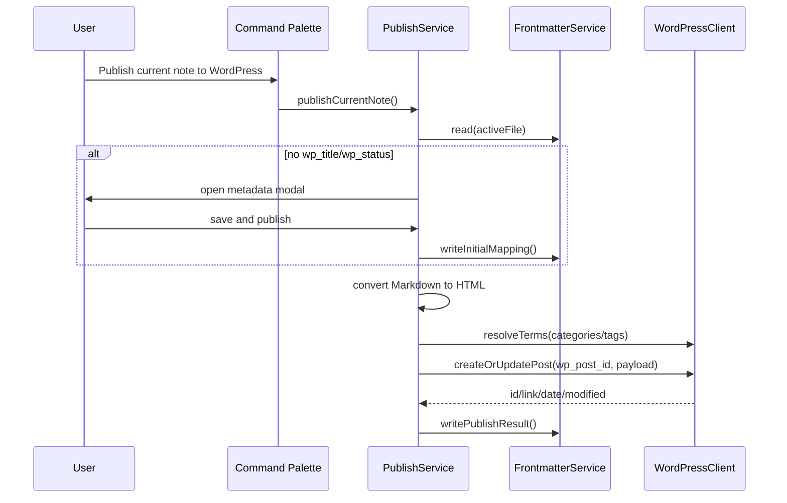

# Obsidian to WordPress Demo - Interface Documentation

This document defines the extension seams for the minimal demo. The current implementation publishes the active Markdown note to a self-hosted WordPress site through the WordPress REST API and Application Passwords.

## Frontmatter Contract

The plugin owns the following fields in the note frontmatter:

```yaml
wp_title: My WordPress Title
wp_slug: my-wordpress-title
wp_status: draft
wp_excerpt: Optional excerpt
wp_categories:
  - Tech
  - Notes
wp_tags:
  - obsidian
  - wordpress
wp_post_id: 123
wp_url: https://example.com/my-wordpress-title/
wp_published_at: 2026-04-21T10:00:00
wp_updated_at: 2026-04-21T10:00:00
```

Required fields for a mapped note:

- `wp_title`: WordPress post title.
- `wp_status`: one of `draft`, `publish`, `private`, `pending`.

Optional input fields:

- `wp_slug`: post slug. Empty means WordPress decides.
- `wp_excerpt`: post excerpt.
- `wp_categories`: category names. Missing WordPress terms are created.
- `wp_tags`: tag names. Missing WordPress terms are created.

Output fields written after publish:

- `wp_post_id`: WordPress post ID. If present, later publishes update this post.
- `wp_url`: WordPress permalink returned by REST API.
- `wp_published_at`: WordPress `date` value.
- `wp_updated_at`: WordPress `modified` value.

## Module Interfaces

### `src/types.ts`

Central shared type definitions.

Important interfaces:

- `WordPressPluginSettings`: persisted plugin settings.
- `WordPressFrontmatter`: plugin-owned frontmatter fields.
- `PostMetadataInput`: normalized publish metadata used by the publisher.
- `WordPressPostPayload`: payload sent to `/wp-json/wp/v2/posts`.
- `WordPressPostResponse`: minimal response consumed from WordPress.
- `Logger`: logging abstraction used by all services.

### `src/publisher.ts`

Coordinates the publish use case.

Public API:

```ts
class PublishService {
  constructor(app: App, settings: WordPressPluginSettings, logger: Logger)
  publishCurrentNote(): Promise<void>
}
```

Responsibilities:

- Validate plugin settings.
- Get the active Markdown file.
- Decide whether initial metadata collection is needed.
- Strip Obsidian frontmatter from the body.
- Upload local images through the selected storage provider and rewrite image references.
- Convert Obsidian Markdown to HTML.
- Resolve categories and tags.
- Check remote modification time before overwriting an existing WordPress post.
- Create or update the WordPress post.
- Write publish result back to frontmatter.

Future extension points:

- Add pre-publish validation.
- Add image upload before payload creation.
- Add conflict detection before update.
- Add preview before publish.

### `src/frontmatter.ts`

Owns all frontmatter parsing and mutation.

Public API:

```ts
class FrontmatterService {
  read(file: TFile): WordPressFrontmatter
  hasRequiredMapping(metadata: WordPressFrontmatter): boolean
  writeInitialMapping(file: TFile, input: PostMetadataInput): Promise<void>
  writePublishResult(file: TFile, response: WordPressPostResponse): Promise<void>
  writePostStatus(file: TFile, status: WordPressPostStatus): Promise<void>
  clearWordPressMapping(file: TFile): Promise<void>
  buildInputFromFrontmatter(metadata: WordPressFrontmatter): PostMetadataInput
}

function stripFrontmatter(rawContent: string): string
function normalizeStringList(value: unknown): string[]
```

Future extension points:

- Support alternate frontmatter field names.
- Support per-site mappings.
- Add schema migration for old field versions.

### `src/image-assets.ts`

Resolves local image references, uploads them to WordPress media, and rewrites Markdown image references before HTML conversion.

Public API:

```ts
interface ImageAssetProcessor {
  rewriteMarkdownImages(markdown: string, sourcePath: string): Promise<string>
}

class WordPressImageAssetProcessor implements ImageAssetProcessor
```

Currently handled:

- Storage provider selection: WordPress Media Library or Aliyun OSS.
- Obsidian embeds: `![[image.png]]`.
- Obsidian embeds with alias or size: `![[image.png|alt]]`, `![[image.png|300]]`.
- Local Markdown images: ``.
- Images inside Obsidian Admonition fences like ` ```ad-tip `.
- Remote/data/app/file URLs are skipped.
- Images in normal fenced code blocks are skipped.
- Uploads are cached within one publish operation by vault path.
- Unchanged images are reused across later publishes through `settings.mediaCache`.
- Cached media URLs are checked before reuse. `404` and `410` clear the cache and trigger re-upload; network, permission, hotlink-protection, and ambiguous statuses keep the cache to avoid false re-uploads.
- Supported image types are compressed before upload using `settings.imageCompressionQuality`.
- Large prepared uploads trigger a confirmation modal when they exceed `settings.largeImageThresholdMb`.

Current limitations:

- Cache invalidation uses vault path, file size, mtime, and compression quality; it does not hash file bytes yet.
- No featured image support.
- No non-image attachment support.
- SVG upload depends on the target WordPress site's upload policy.

Future extension points:

- Add content-hash-based media cache invalidation.
- Add image size/alt/caption/frontmatter controls.
- Add featured image selection.
- Add non-image attachment upload.

### `src/storage/image-storage-provider.ts`

Defines pluggable image storage providers.

Public API:

```ts
interface ImageStorageProvider {
  readonly id: "wordpress" | "aliyun-oss"
  uploadImage(input: ImageUploadInput): Promise<ImageUploadResult>
}

function createImageStorageProvider(settings, wordpressClient, logger): ImageStorageProvider
```

### `src/storage/wordpress-media-provider.ts`

Uploads images to WordPress Media Library through `/wp-json/wp/v2/media`.

### `src/storage/aliyun-oss-provider.ts`

Uploads images directly to Aliyun OSS using OSS V1 AccessKey signing.

Current behavior:

- Uses `PUT` object upload.
- Supports bucket endpoint or normal regional endpoint.
- Returns URLs based on configured `publicBaseUrl`; query and hash fragments are stripped to avoid temporary signed URL parameters in posts.
- Uses custom object key rules from settings.
- Parses common OSS XML errors into actionable messages while preserving raw response text in logs.
- Exposes endpoint mismatch as `AliyunOssEndpointMismatchError` so callers can ask the user to switch to the recommended endpoint.

Security note:

- Direct AccessKey upload is intended for personal/local usage.
- A future public version should use STS or backend-signed upload.

### `src/storage/object-key-builder.ts`

Builds OSS object keys from configurable rules.

Supported tokens:

- `{postTitle}`
- `{fileName}`
- `{fileBaseName}`
- `{ext}`
- `{yyyy}`
- `{mm}`
- `{dd}`
- `{hash}`

### `src/media-url-checker.ts`

Checks whether a cached WordPress media URL still appears usable before reusing it.

Public API:

```ts
type MediaUrlStatus = "available" | "missing" | "unknown"

interface MediaUrlChecker {
  check(url: string): Promise<MediaUrlStatus>
}

class HttpMediaUrlChecker implements MediaUrlChecker
```

Current behavior:

- Tries `HEAD` first.
- Falls back to ranged `GET` when the result is ambiguous.
- Treats `2xx`, `3xx`, and `206` as available.
- Treats `404` and `410` as missing.
- Treats network failures, auth/permission responses, hotlink-protection responses, and other ambiguous statuses as unknown.
- Accepts an optional `Referer` for OSS hotlink-protection testing.

### `src/image-compressor.ts`

Prepares image bytes for upload.

Public API:

```ts
interface ImageCompressor {
  prepare(file: TFile, body: ArrayBuffer, mimeType: string, quality: number): Promise<PreparedImageUpload>
}

class BrowserImageCompressor implements ImageCompressor
```

Current behavior:

- Compresses JPEG and WebP through browser canvas APIs.
- Converts PNG without transparency to JPEG when that makes the upload smaller.
- Keeps PNG with transparency, GIF/APNG/AVIF/SVG, and failed compression attempts as original bytes.
- Uses the original bytes if compressed output is not smaller.

### `src/upload-confirm-modal.ts`

Shows a confirmation dialog before uploading images that exceed the configured large-image threshold after compression/preparation.

Public API:

```ts
function confirmLargeImageUpload(app: App, info: LargeUploadInfo): Promise<boolean>
```

### `src/special-formats.ts`

Preprocesses Obsidian/Markdown special formats before HTML rendering and restores protected formats after rendering.

Public API:

```ts
interface MarkdownSpecialFormatTransformer {
  beforeRender(markdown: string): string
  afterRender(html: string): string
}

class ObsidianSpecialFormatTransformer implements MarkdownSpecialFormatTransformer
```

Currently handled:

- Code blocks: preserved through Obsidian's Markdown renderer, then postprocessed with stable inline styles for spacing, borders, overflow, and compact `.copy-code-button` placement.
- Math formulas: `$...$` and `$$...$$` are protected and emitted as MathJax-compatible `\(...\)` / `\[...\]` HTML wrappers. WordPress still needs a MathJax or KaTeX frontend renderer.
- Mermaid: fenced `mermaid` blocks are passed through Obsidian's native Markdown renderer so the published HTML contains the rendered diagram output instead of raw Mermaid source. This supports Mermaid diagram types such as `flowchart`, `sequenceDiagram`, `classDiagram`, `stateDiagram`, and `gantt`.
- Compatibility aliases: fenced `flowchart` or `flow` blocks are emitted as `<pre class="obsidian-flowchart flowchart">...</pre>`, but new notes should prefer fenced `mermaid` blocks.
- Footnotes: passed through Obsidian's Markdown renderer.
- Highlight: `==text==` becomes `<mark>text</mark>`.
- Strikethrough: `~~text~~` becomes `<del>text</del>`.
- Task lists: passed through Obsidian's Markdown renderer.
- Tables: postprocessed into responsive `owp-table-wrapper` containers with inline table, border, header, padding, and zebra-striping styles.
- Obsidian comments: `%% comment %%` blocks are removed before publishing.
- Obsidian Admonition/Callout plugin HTML is normalized with WordPress-safe inline layout styles; SVG icons are kept but constrained to normal text-icon size.

Future extension points:

- Replace regex-based transformations with a Markdown AST pipeline.
- Add WordPress CSS enqueueing for callouts/task lists.
- Render Mermaid to SVG before upload.
- Render math to static KaTeX HTML before upload.

### `src/markdown-converter.ts`

Converts the note body from Obsidian Markdown to HTML before upload.

Public API:

```ts
interface MarkdownConverter {
  toHtml(markdown: string, sourcePath: string): Promise<string>
}

class ObsidianMarkdownConverter implements MarkdownConverter
```

Current behavior:

- Runs `ObsidianSpecialFormatTransformer.beforeRender`.
- Uses Obsidian's built-in `MarkdownRenderer`.
- Runs `ObsidianSpecialFormatTransformer.afterRender`, including image tag normalization, table styling, and code-block copy-button normalization.
- Returns the generated `innerHTML`.
- Keeps the converter behind an interface so future implementations can use a different Markdown engine or generate Gutenberg blocks.

Future extension points:

- Upload local images before rendering final HTML.
- Rewrite internal links.
- Generate WordPress block markup.
- Preserve raw Markdown in a WordPress custom field.

### `src/remote-post-service.ts`

Coordinates remote post actions for already-published notes.

Public API:

```ts
class RemotePostService {
  showCurrentRemoteStatus(): Promise<void>
  unpublishCurrentPost(): Promise<void>
  deleteCurrentRemotePost(): Promise<void>
}
```

Responsibilities:

- Read `wp_post_id` from the active note.
- Fetch remote status from WordPress.
- Move a remote post back to `draft`.
- Trash or permanently delete a remote post after confirmation.
- Clear all plugin-managed `wp_*` frontmatter after trash/delete so later publishes start from a clean mapping.

### `src/remote-post-modals.ts`

Provides UI for remote status display, overwrite-conflict confirmation, and trash/delete confirmation.

Public API:

```ts
function confirmRemoteOverwrite(app: App, remote: WordPressPostResponse, localUpdatedAt?: string): Promise<"overwrite" | "cancel">
function confirmRemoteDelete(app: App, remote: WordPressPostResponse): Promise<"trash" | "delete" | "cancel">
class RemoteStatusModal extends Modal
```

### `src/status-modal.ts`

Lets the user change the current note's `wp_status` after initial mapping, for example from `draft` to `publish` before republishing.

Public API:

```ts
function choosePostStatus(app: App, currentStatus: WordPressPostStatus): Promise<WordPressPostStatus | undefined>
```

### `src/wordpress-client.ts`

Thin WordPress REST API client.

Public API:

```ts
class WordPressClient {
  constructor(settings: WordPressPluginSettings, logger: Logger)
  createOrUpdatePost(postId: number | undefined, payload: WordPressPostPayload): Promise<WordPressPostResponse>
  resolveTerms(taxonomy: "categories" | "tags", names: string[]): Promise<number[]>
}
```

Current endpoints:

- `GET /wp-json/wp/v2/posts/:id?context=edit`
- `GET /wp-json/wp/v2/categories?per_page=100&hide_empty=false`
- `POST /wp-json/wp/v2/categories`
- `DELETE /wp-json/wp/v2/categories/:id?force=true`
- `POST /wp-json/wp/v2/media`
- `POST /wp-json/wp/v2/posts`
- `POST /wp-json/wp/v2/posts/:id`
- `DELETE /wp-json/wp/v2/posts/:id?force=false|true`
- `GET /wp-json/wp/v2/categories?search=...`
- `POST /wp-json/wp/v2/categories`
- `GET /wp-json/wp/v2/tags?search=...`
- `POST /wp-json/wp/v2/tags`

Future extension points:

- Media upload via `/wp-json/wp/v2/media`.
- Custom post types.
- Custom fields.
- Capability checks.
- Retry/backoff.

### `src/metadata-modal.ts`

Initial metadata collection modal.

Public API:

```ts
class MetadataModal extends Modal {
  constructor(
    app: App,
    defaults: { title: string; status: WordPressPostStatus },
    onSubmit: (input: PostMetadataInput) => void | Promise<void>,
    categoryActions?: CategorySelectorActions
  )
}
```

Responsibilities:

- Ask for required fields when frontmatter is missing.
- Load WordPress categories into a selector instead of requiring manual category text input.
- Display WordPress categories as a parent/child hierarchy using the REST API `parent` field.
- Add WordPress categories from the publish modal, including optional parent category selection.
- Delete WordPress categories from the publish modal.
- Save user input through the callback.

Future extension points:

- Fetch category/tag suggestions from WordPress.
- Add validation for slug format.
- Add preview of generated frontmatter.

### `src/settings.ts`

Settings defaults and settings tab.

Public API:

```ts
const DEFAULT_SETTINGS: WordPressPluginSettings
class WordPressSettingTab extends PluginSettingTab
```

Settings:

- `siteUrl`: self-hosted WordPress base URL.
- `username`: WordPress username.
- `applicationPassword`: WordPress Application Password.
- `defaultStatus`: default status for first publish.
- `debug`: if true, show full logs after every upload; otherwise show logs only on failure.

### `src/logger.ts`

In-memory publish logger.

Public API:

```ts
class PublishLogger implements Logger
function showLogNotice(title: string, logger: Logger): void
```

Future extension points:

- Replace `Notice` with a dedicated log panel.
- Persist logs to a local file.
- Redact secrets in debug output.

## Publish Sequence


